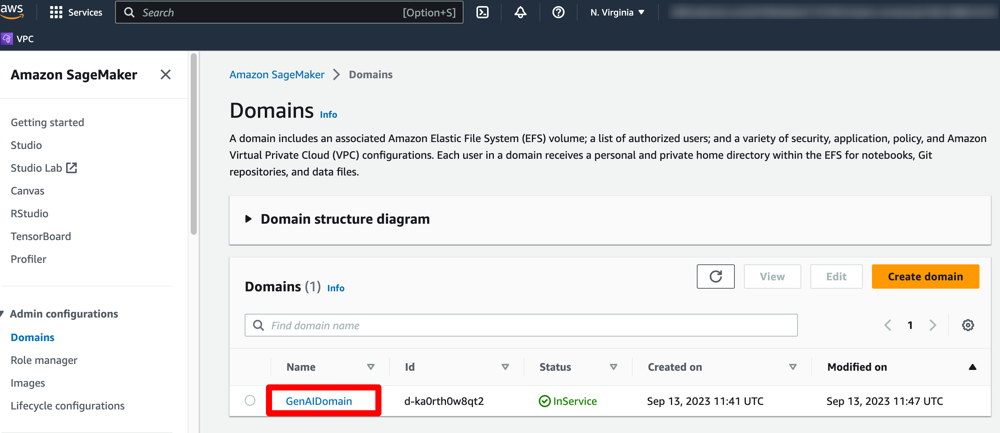
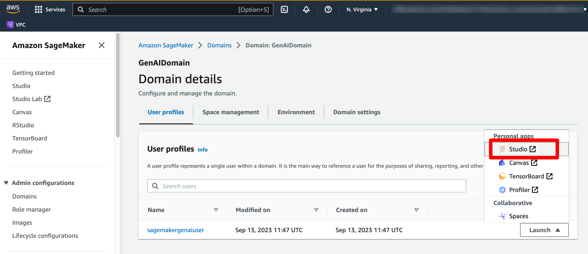
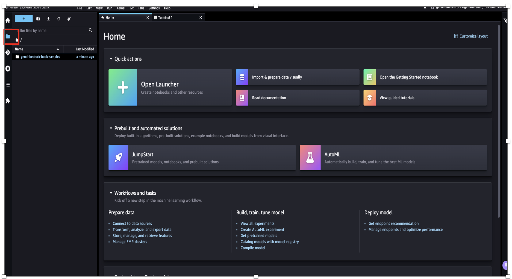

---

# Chapter Name: Introduction to Amazon Bedrock
##### Chapter: 18
##### Github name: genai-bedrock-book-samples
##### Folder: chapter18
##### Book Name: A Definitive Guide to Generative AI with Amazon Bedrock

---


## Prerequisite

* [AWS Console access](https://aws.amazon.com/console/)
* [IAM](https://aws.amazon.com/iam/) access role to execute AWS CloudFormation template
* [IAM](https://aws.amazon.com/iam/) access Creating Amazon SageMaker domain, Amazon SageMaker domain user, AWS Lambda, and AWS IAM roles & policies

## AWS region for implementation Amazon SageMaker domain 

us-east-1 

## Account allowlisting
To run this source code, your account must be included on the Amazon Bedrock allowlist. Please ensure that your account is activated and allowlisted before executing this source code.

---

### **Section 1**: Jupyter Notebook & GitHub
**Purpose**: Executing Jupyter Notebooks and Cloning Example Source Code.

---

Executing Jupyter Notebooks and cloning example source code enables hands-on learning and practical engagement with concepts. By running code directly, users can better understand the mechanics of each example, experiment with modifications, and troubleshoot in real time, deepening their knowledge and enhancing their skill development.

## Executing Jupyter Notebooks

1. In the AWS Management Console search bar, type **"sagemaker"**. Then, select **Amazon SageMaker**.


2. In the Amazon SageMaker Console, click **Domains** in the left-side navigation menu.


3. You will view **genai-bedrock-book-sagemaker-basic** as **Domain**. 

4. Click **genai-bedrock-book-sagemaker-basic** in the **Domains** section. Click **User profiles**.



5. Click **Launch**. Click **Studio**.



6. Wait for the **Amazon SageMaker Studio** to come online. It will take **~2-3 mins** to open **Amazon SageMaker Studio**.


7. This takes you to **Amazon SageMaker Studio**. Click **Studio Clasic**.


8. Click **Run** in the **Amazon SageMaker Studio**. 


9. Click **Open** in the **Amazon SageMaker Studio**. 


10. This takes you to **Amazon SageMaker Studio**.


11. Click **File**. Choose **New**. Choose **Terminal**.


## Clone the GitHub repository 

1. Execute the following git command.

```
git clone < Git Repository Name>

```

> [!NOTE]
> Git Repository Name: Please refer book Appendix section. 

2. Click **File Browser** in the left side panel of **Amazon SageMaker Studio** to view all code files. 



3. Click *chapter18*. Open **advanced_image_patterns_part1.ipynb** file. 

4. Use *Image* as **Data Science 3.0**. *Kernel* as **Python 3**. *Instance* as **ml.t3.medium**.


5. Read and follow all the steps of **advanced_image_patterns_part1.ipynb** file. 

### File Name: advanced_image_patterns_part1.ipynb
### Purpose: 
        1. Perfecting Prompt for Image
        2. Image Embedding
        3. Image to Image

6. Click *chapter18*. Open **advanced_image_patterns_part2.ipynb** file. 

7. Use *Image* as **Data Science 3.0**. *Kernel* as **Python 3**. *Instance* as **ml.t3.medium**.


8. Read and follow all the steps of **advanced_image_patterns_part2.ipynb** file. 

### File Name: advanced_image_patterns_part2.ipynb
### Purpose: 
        1. Image Inpainting
        2. Image Conditioning
        3. Colour Conditioning
        4. Image Outpainting
        5. Background Removal 
        6. Combination of Text and Image

9. Click *chapter18*. Open **advanced_image_patterns_part3.ipynb** file. 

10. Use *Image* as **Data Science 3.0**. *Kernel* as **Python 3**. *Instance* as **ml.t3.medium**.


11. Read and follow all the steps of **advanced_image_patterns_part3.ipynb** file. 

### File Name: advanced_image_patterns_part3.ipynb
### Purpose: 
        1. Image model customization

> [!CAUTION]
> If you are running this in your own account, please be aware that costs may be incurred. The exact expenses depend on factors such as the frequency of your calls to Bedrock, the length of tokens or the size of images in your calls, and the specific models you utilize. For detailed pricing information for each model, please refer to the Amazon Bedrock console. Even, you will get specific note before every exercises. 

## Clean up

If you dont want to continue with this hands on exercise further, Please follow the **Delete** the AWS CloudFormation stack to avoid incurring future charges and to clean up unused roles and policies, delete the resources you created as part of the execution of the AWS CloudFormation stack. 