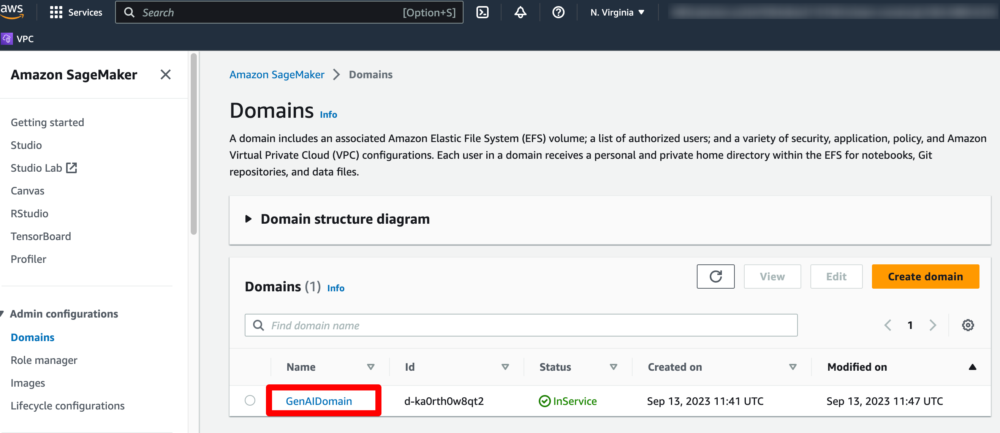
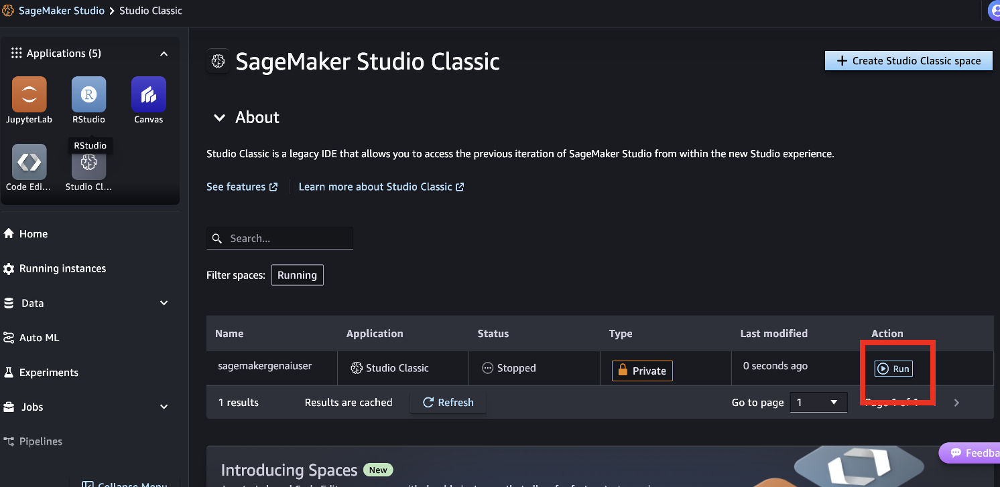
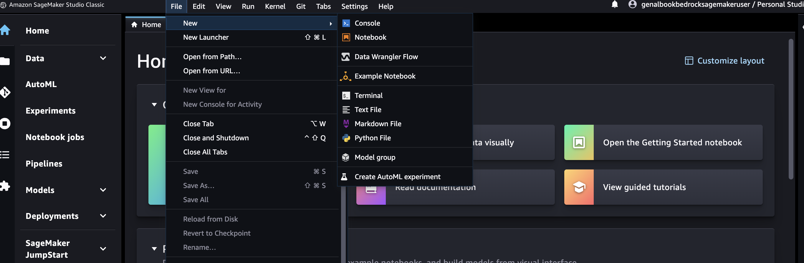
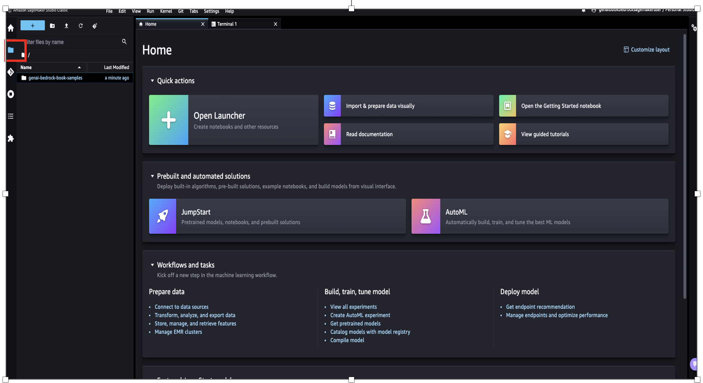

---

# Chapter Name: Introduction to Amazon Bedrock
##### Chapter: 3 
##### Github name: genai-bedrock-book-samples
##### Folder: chapter3
##### Book Name: A Definitive Guide to Generative AI with Amazon Bedrock

---


## Prerequisite

* [AWS Console access](https://aws.amazon.com/console/)
* [IAM](https://aws.amazon.com/iam/) access role to execute AWS CloudFormation template
* [IAM](https://aws.amazon.com/iam/) access Creating Amazon SageMaker domain, Amazon SageMaker domain user, AWS Lambda, and AWS IAM roles & policies

## AWS region for implementation Amazon SageMaker domain 

us-east-1 

## Account allowlisting
To run this source code, your account must be included on the Amazon Bedrock allowlist. Please ensure that your account is activated and allowlisted before executing this source code.

---

### **Section 1**: Jupyter Notebook & GitHub
**Purpose**: Executing Jupyter Notebooks and Cloning Example Source Code.

---

Executing Jupyter Notebooks and cloning example source code enables hands-on learning and practical engagement with concepts. By running code directly, users can better understand the mechanics of each example, experiment with modifications, and troubleshoot in real time, deepening their knowledge and enhancing their skill development.

## Executing Jupyter Notebooks

1. In the AWS Management Console search bar, type **"sagemaker"**. Then, select **Amazon SageMaker**.


2. In the Amazon SageMaker Console, click **Domains** in the left-side navigation menu.


3. You will view **genai-bedrock-book-sagemaker-basic** as **Domain**. 

4. Click **genai-bedrock-book-sagemaker-basic** in the **Domains** section. Click **User profiles**.



5. Click **Launch**. Click **Studio**.


6. Wait for the **Amazon SageMaker Studio** to come online. It will take **~2-3 mins** to open **Amazon SageMaker Studio**.


7. This takes you to **Amazon SageMaker Studio**. Click **Studio Clasic**.


8. Click **Run** in the **Amazon SageMaker Studio**. 



9. Click **Open** in the **Amazon SageMaker Studio**. 


10. This takes you to **Amazon SageMaker Studio**.


11. Click **File**. Choose **New**. Choose **Terminal**.



## Clone the GitHub repository 

1. Execute the following git command.

```
git clone < Git Repository Name>

```

> [!NOTE]
> Git Repository Name: Please refer book Appendix section. 

2. Click **File Browser** in the left side panel of **Amazon SageMaker Studio** to view all code files. 



3. Click *chapter3*. Open **simple_sagemaker_bedrock.ipynb** file. 

4. Use *Image* as **Data Science 3.0**. *Kernel* as **Python 3**. *Instance* as **ml.t3.medium**.


5. Read and follow all the steps of **simple_sagemaker_bedrock.ipynb** file. 

### File Name: simple_sagemaker_bedrock.ipynb
### Purpose: 
    1. Understanding Amazon Bedrock client and Amazon Bedrock runtime client.
    2. Understanding of list_foundation_models API.
    3. Example of Amazon Titan LLM foundation model with and without parameters.
    4. Example of Anthropic LLM foundation model with and without parameters.
    5. Example of Amazon Titan Image foundation model with and without parameters.
    6. Example of Amazon Titan LLM foundation model with streaming API with and with out parameters.

---

### **Section 2**: Streamlite Application 
**Purpose**: Executing Streamlite Application.

---

Executing a Streamlit application for Generative AI allows you to create an interactive, web-based interface that enables users to experiment with AI models like Titan and Claude. Streamlit provides a simple and effective way to visualize results, adjust parameters like temperature, top-p, and max tokens, and instantly see the output from the AI model in response to custom prompts.

## Streamlite Application

1. Click **File Browser** in the left side panel of **Amazon SageMaker Studio** to view all code files. 


2. Click *chapter3*. Open **simple_bedrock_application.py** file. Understand the file.

3. Use *Image* as **Data Science 3.0**. *Kernel* as **Python 3**. *Instance* as **ml.t3.medium**.


4. Execute the following command to install dependent files.

```
pip3 install boto3 botocore langchain streamlit altair==4.2.0

```

5. Execute the Streamlite Application.

```
streamlit run simple_bedrock_application.py --server.runOnSave true --server.port 8502

```

6. Step 1: Open the application at the browser. 


Locate the Amazon SageMaker URL. For example, in the figure above, the full URL is: https://d-5jiufdkc0efm.studio.us-east-1.sagemaker.aws/jupyter/default/lab/tree/genai-bedrock-book-samples/chapter3/simple_bedrock_application.py

The Amazon SageMaker URL is: https://d-5jiufdkc0efm.studio.us-east-1.sagemaker.aws

7. Step 2: Open the application at the browser. 


So, Streamlit application URL would follow the structure:

https://d-5jiufdkc0efm.studio.us-east-1.sagemaker.aws/jupyter/default/proxy/[PORT_NUMBER]/
Here, replace [PORT_NUMBER] with the specific port number your Streamlit app is running on. The proxy path is used to access applications running on a custom port within SageMaker Studio.

### File Name: simple_bedrock_application.py
### Purpose: 
    1. Bedrock Client Initialization:
        Sets up a Bedrock client (boto3_bedrock_runtime_client) for model invocation.
    2. Model Invocation:
        invoke_bedrock_model: Invokes the selected Bedrock model and returns the response, handling JSON decoding and potential client errors.
        handle_client_error: Manages AWS-specific errors, such as AccessDeniedException, showing an appropriate message.
    3. Model Response Functions:
        get_response_bedrock_claude: Invokes the Claude model, formatting parameters like temperature and top_p for inference and returns the text content.
        get_response_bedrock_titan: Similar to the Claude function but customized for the Titan model.
    4. Model Selection and Prompt Input:
        call_bedrock_function: Decides which model-specific function to call based on the selected model ID.
        get_model_id: Maps user-friendly model names to Bedrock model IDs.
    5. Streamlit User Interface (UI):
        The UI includes a title, parameter sliders (temperature, top_p, top_k, max tokens), and a text area for prompt input.
        Adds a CSS-styled vertical line for visual separation between parameter and input sections.
        Sets default prompt text for user guidance.
        Upon submitting, a loading spinner is shown while the selected model processes the prompt. The response is displayed in a large text area.

> [!CAUTION]
> If you are running this in your own account, please be aware that costs may be incurred. The exact expenses depend on factors such as the frequency of your calls to Bedrock, the length of tokens or the size of images in your calls, and the specific models you utilize. For detailed pricing information for each model, please refer to the Amazon Bedrock console. Even, you will get specific note before every exercises. 

## Clean up

If you dont want to continue with this hands on exercise further, Please follow the **Delete** the AWS CloudFormation stack to avoid incurring future charges and to clean up unused roles and policies, delete the resources you created as part of the execution of the AWS CloudFormation stack. 