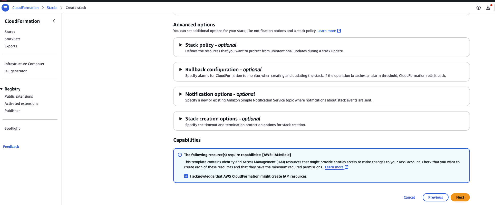

---

# Chapter Name: Introduction to Amazon Bedrock
##### Chapter: 3 
##### Github name: genai-bedrock-book-samples
##### Folder: cloudformation
##### Book Name: A Definitive Guide to Generative AI with Amazon Bedrock

---

---

### **Section 1**: Executing AWS CloudFormation scripts  
**Purpose**: Provisioning resources in your AWS account for **A Definitive Guide to Generative AI with Amazon Bedrock** book hands-on exercises.

---

To expedite the implementation of practising all the exercise of **A Definitive Guide to Generative AI with Amazon Bedrock** book, you can use the AWS Cloud Formation template [AWS CloudFormation](https://aws.amazon.com/cloudformation/) for your convenience. AWS CloudFormation serves as a powerful management tool, enabling you to define and provision all necessary infrastructure resources within AWS using a unified and standardized language.

> [!CAUTION]
> This CloudFormation template creates an Amazon SageMaker domain with IAM roles and policies for the Amazon Bedrock Book. It is intended for practice purposes and does not adhere to least privilege best practices. You can use this template as a foundation and modify it to implement least privilege based on your specific requirements. 

The AWS CloudFormation template will create following things: 

**Parameters:**

    1. UserProfileName: Defines the name of the user profile for SageMaker and Amazon Bedrock, with a default value of genalbookbedrocksagemakeruser.

**Resources:**

    1. SageMaker User Profile (GenAIBookBedrockSageMakerUser): Creates a user profile for SageMaker, using an execution role specified in the GenAIBookBedrockSageMakerExecutionRole resource.

    2. Lambda Function (DefaultVpcLambda): A Lambda function, CFGetDefaultVpcId, is defined to retrieve the default VPC ID and subnets. This function uses boto3 to interact with EC2 services and returns VPC details.

    3. Custom Resource (DefaultVpcFinder): Calls the Lambda function to fetch the VPC and subnet details, allowing other resources to use this data.

    4. Lambda Execution Role (LambdaExecutionRole): An IAM role for the Lambda function, granting permissions for EC2 read-only access, S3 full access, IAM full access, SageMaker, and Lambda execution.

    5. SageMaker Domain (GenAIBookBedrockSageMakerDomain): Creates a SageMaker domain that uses IAM authentication, with default user settings tied to the execution role (GenAIBookBedrockSageMakerExecutionRole). It also includes network configurations using the default VPC and subnet IDs.

    6. SageMaker Execution Role (GenAIBookBedrockSageMakerExecutionRole): Defines an IAM role for executing SageMaker, Bedrock, and AOSS tasks. This role has attached policies granting broad access to SageMaker, Bedrock, AOSS, S3, and IAM services, though the template advises modification to adhere to the least privilege principle.

**Outputs:**

    1. Provides the Amazon Resource Names (ARNs) for the created SageMaker domain and execution role, which can be referenced in other AWS resources or applications.

## Prerequisite

* [AWS Console access](https://aws.amazon.com/console/)
* [IAM](https://aws.amazon.com/iam/) access role to execute AWS CloudFormation template
* [IAM](https://aws.amazon.com/iam/) access Creating Amazon SageMaker domain, Amazon SageMaker domain user, AWS Lambda, and AWS IAM roles & policies

## AWS region for implementation Amazon SageMaker domain 

us-east-1 

## Account allowlisting
To run this source code, your account must be included on the Amazon Bedrock allowlist. Please ensure that your account is activated and allowlisted before executing this source code.

## Deploy resources with AWS CloudFormation

We create required resources with AWS CloudFormation, including Amazon SageMaker domain, Amazon SageMaker domain user, AWS Lambda function, and [AWS Identity and Access Management](https://aws.amazon.com/iam/) (IAM) role. Complete the following steps:

1. Ensure that you are logged into the AWS console with your credentials.

2. To launch the CloudFormation stack, choose [**Launch Stack**](https://us-east-1.console.aws.amazon.com/cloudformation/home?region=us-east-1#/stacks/create). 


2. Choose **Choose an existing template**. Choose **Upload a template file**. 

3. Choose File **genai-bedrock-book-samples-sagemaker-basic.yml**. Click **Next**.

4. Provide **Stack name**. 

5. Leave **UserProfileName** parameter at their default values. Click **Next**.


6. **scroll down**. After verifying all the options, acknowledge the message for IAM resource creation as mentioned in the following screenshot and click on the **Next** buttion.



7. **scroll down**. After verifying all the options, click on the **Submit** buttion.


    * The stack takes about 10 minutes to complete.
    * Now that the CloudFormation stack is complete.

> [!CAUTION]
> Costs when running from your own account
> If you are running this in your own account, please be aware that costs may be incurred. The exact expenses depend on factors such as the frequency of your calls to Bedrock, the length of tokens or the size of images in your calls, and the specific models you utilize. For detailed pricing information for each model, please refer to the Amazon Bedrock console. Even, you will get specific note before every exercises. 

---

### **Section 2**: Jupyter Notebook & GitHub
**Purpose**: Executing Jupyter Notebooks and Cloning Example Source Code.

---

Executing Jupyter Notebooks and cloning example source code enables hands-on learning and practical engagement with concepts. By running code directly, users can better understand the mechanics of each example, experiment with modifications, and troubleshoot in real time, deepening their knowledge and enhancing their skill development.

## Executing Jupyter Notebooks

1. In the AWS Management Console search bar, type **"sagemaker"**. Then, select **Amazon SageMaker**.


2. In the Amazon SageMaker Console, click **Domains** in the left-side navigation menu.


3. Click **genai-bedrock-book-sagemaker-basic** in the **Domains** section. Click **User profiles**.


4. Click **Launch**. Click **Studio**.


5. Wait for the **Amazon SageMaker Studio** to come online. It will take **~2-3 mins** to open **Amazon SageMaker Studio**.


6. This takes you to **Amazon SageMaker Studio**. Click **Studio Clasic**.


7. Click **Run** in the **Amazon SageMaker Studio**. 


8. Click **Open** in the **Amazon SageMaker Studio**. 


9. This takes you to **Amazon SageMaker Studio**.


10. Click **File**. Choose **New**. Choose **Terminal**.


## Clone the GitHub repository 

1. Execute the following git command.

```
git clone < Git Repository Name>

```

> [!NOTE]
> Git Repository Name: Please refer book Appendix section. 

2. Click *File Browser** in the left side panel of **Amazon SageMaker Studio** to view all code files. 


3. Click *chapter3*. Open **simple_sagemaker_bedrock.ipynb** file. 

4. Use *Image* as **Data Science 3.0**. *Kernel* as **Python 3**. *Instance* as **ml.t3.large**. Click **Create Notebook**.


5. Read and follow all the steps of **simple_sagemaker_bedrock.ipynb** file. 

> [!CAUTION]
> Costs when running from your own account
> If you are running this in your own account, please be aware that costs may be incurred. The exact expenses depend on factors such as the frequency of your calls to Bedrock, the length of tokens or the size of images in your calls, and the specific models you utilize. For detailed pricing information for each model, please refer to the Amazon Bedrock console. Even, you will get specific note before every exercises. 

## Clean up

If you dont want to continue with this hands on exercise further, Please follow the **Delete** the AWS CloudFormation stack to avoid incurring future charges and to clean up unused roles and policies, delete the resources you created as part of the execution of the AWS CloudFormation stack. 